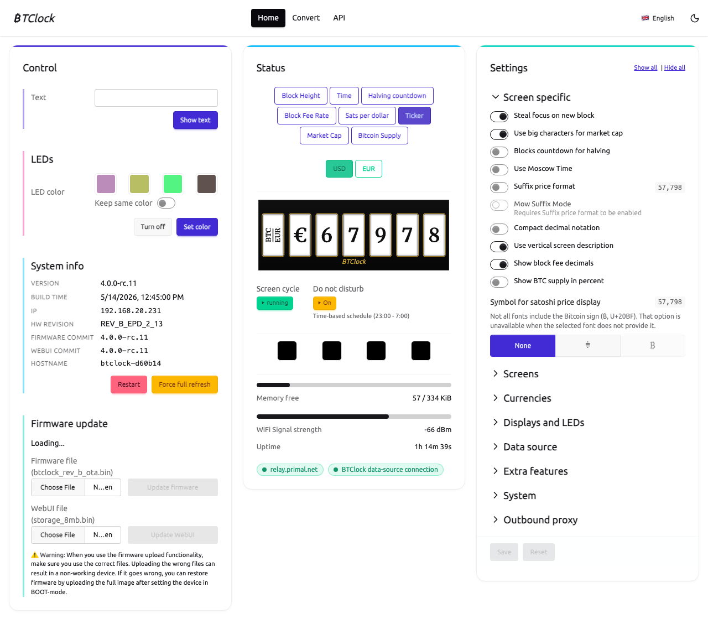
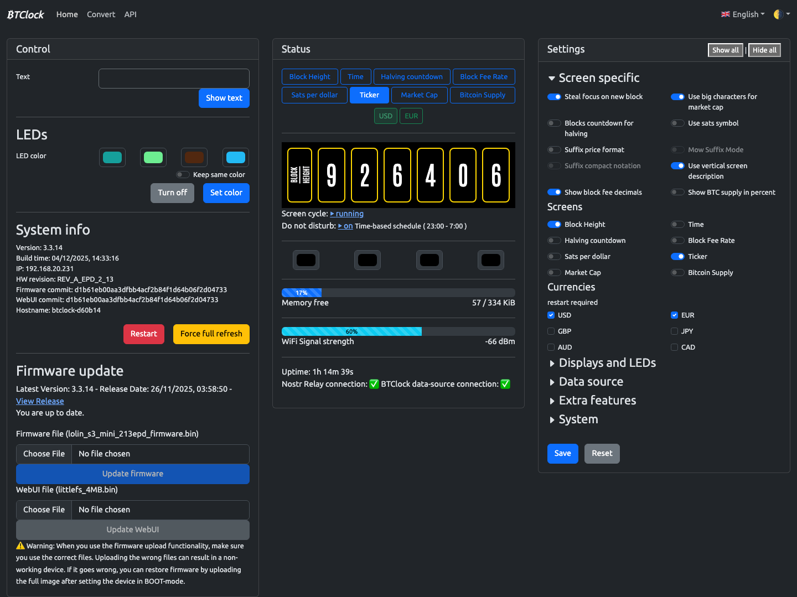

# BTClock WebUI

[](https://git.btclock.dev/btclock/webui/releases/latest)
[](https://git.btclock.dev/btclock/webui/actions?workflow=build.yaml&actor=0&status=0)

The web user-interface for the BTClock.




## Repository layout

Two codebases live side-by-side during the v2 rewrite:

- `./` — legacy Svelte-kit + Bootstrap WebUI (kept for reference until v2 is signed off).
- `webui-v2/` — new rewrite on SvelteKit 2 + Svelte 5 runes, Tailwind v4, DaisyUI 5, Paraglide JS v2, Valibot, Lucide icons. This is the version that should be used going forward.

All day-to-day development should happen inside `webui-v2/`.

## Working on `webui-v2`

This project is managed with [pnpm](https://pnpm.io). Install it with `corepack enable pnpm` or `npm i -g pnpm` if you don't have it yet.

```bash
cd webui-v2
pnpm install           # runs patch-package for the SvelteKit filename shortening patch
pnpm dev               # start the dev server (http://localhost:5173)
```

### Production build

```bash
cd webui-v2
pnpm build             # produces dist/ with bundle.js + index.html (post-build rewrap)
python3 gzip_build.py  # gzips everything under dist/ into build_gz/
mklittlefs -c build_gz -b 4096 -p 256 -s 4194304 output/littlefs_4MB.bin
```

The post-build rewrap step in `vite.config.ts` turns SvelteKit's `bundle.html` fallback into a self-contained `bundle.js` that the BTClock firmware mounts inside the `.overlay` container. The filename-shortening patch in `webui-v2/patches/` keeps asset names within LittleFS's filename limit.

### Tests

```bash
cd webui-v2
pnpm test:unit              # vitest unit + component tests
pnpm test:integration       # playwright end-to-end suite
pnpm test:screenshots       # device/locale screenshot suite
pnpm doc:update-screenshots
```

### Key architectural choices

- **Feature-based folders** — UI is organised under `src/lib/features/{clock,control,status,firmware,settings,convert}` with colocated sub-components and spec tests. Generic primitives live in `src/lib/ui/`, data access in `src/lib/api/`, and global state in `src/lib/stores/` as Svelte 5 runes.
- **Discriminated-union state** — `SettingsState` and `StatusState` encode `loading | error | ready`, so every consumer handles each phase explicitly instead of falling through nullable props.
- **Valibot schemas** — Runtime validation for every inbound API payload lives in `src/lib/api/schemas.ts`, protecting the UI from firmware drift.
- **Paraglide JS v2** — Message catalogs in `src/lib/locales/` are compiled per-locale and tree-shaken by the Paraglide Vite plugin.
- **Static output only** — `@sveltejs/adapter-static` with SSR disabled; the WebUI is always mounted on-device by the firmware.

## Legacy project (root)

The root project still builds with `yarn build` / `python3 gzip_build.py` / `mklittlefs` as before. It will be removed once the v2 rewrite is signed off.
