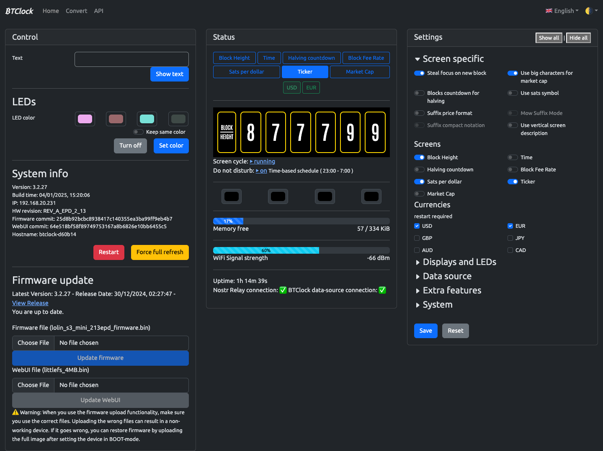

# BTClock WebUI

[](https://git.btclock.dev/btclock/webui/releases/latest)
[](https://git.btclock.dev/btclock/webui/actions?workflow=build.yaml&actor=0&status=0)

The web user-interface for the BTClock, based on Svelte-kit. It uses Bootstrap for the lay-out.




## Developing

After installed dependencies with `yarn`, start a development server:

```bash
yarn dev

# or start the server and open the app in a new browser tab
yarn dev -- --open
```

## Building

To create a production version of the WebUI:

```bash
yarn build
```

Make sure the postinstall script is ran, because otherwise the filenames are to long for the LittleFS filesystem.

## Deploying

To upload the firmware to the BTClock, you need to GZIP all the files. You can use the python script `gzip_build.py` for that:

```bash
python3 gzip_build.py
```

Then you can make a `LittleFS.bin` with mklittlefs:

```bash
mklittlefs -c build_gz -s 409600 littlefs.bin
```

You can preview the production build with `yarn preview`.
