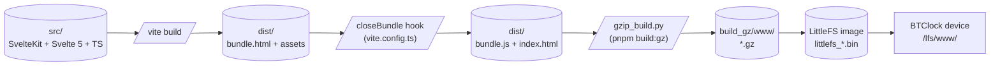
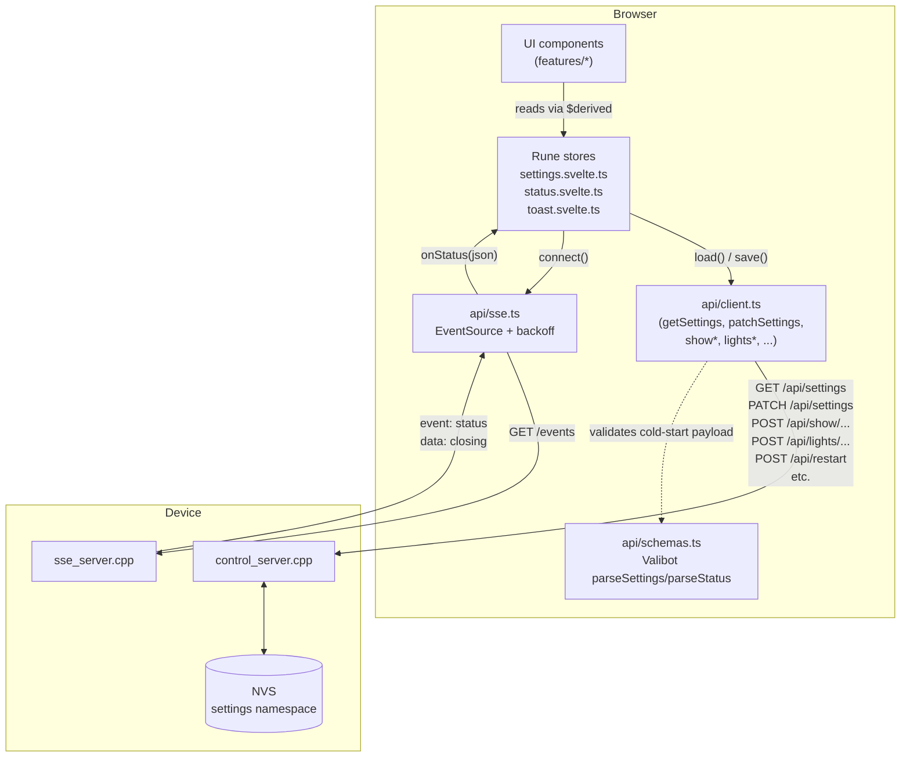
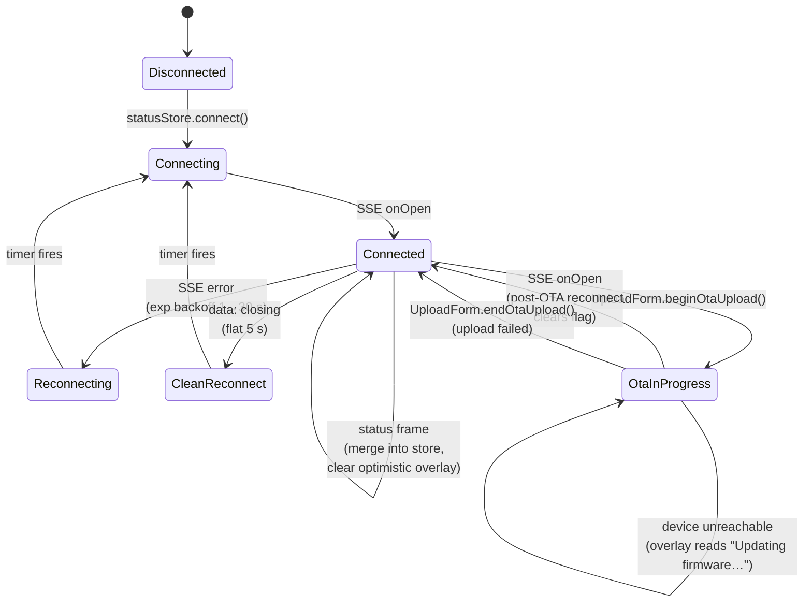
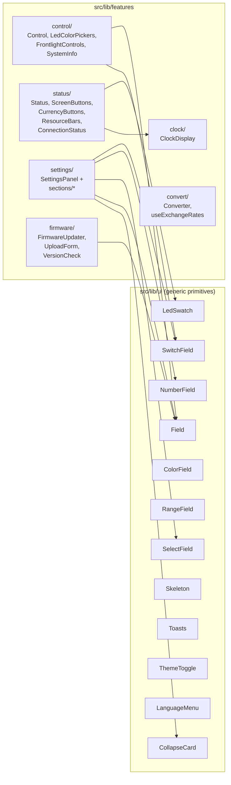

# BTClock WebUI architecture

This file is the **WebUI-side** companion to the firmware repo's
[`docs/ARCHITECTURE.md`](https://git.btclock.dev/btclock/btclock_v4/src/branch/main/docs/ARCHITECTURE.md).
It describes how the SvelteKit code is laid out, how data flows
through it, and how it talks to the firmware. For the contributor
onboarding doc (conventions, common pitfalls, when-to-do-what) see
[`AGENTS.md`](../AGENTS.md).

The diagrams below are [Mermaid](https://mermaid.js.org/) — Forgejo,
GitHub, and most Markdown previewers render them inline. Plain text
fallback is intentional: read the labels.

---

## 1. Build pipeline



Key points:

- `bundleStrategy: 'single'` (svelte.config.js) is required — the
  firmware's `control_server.cpp` only serves a single `bundle.js`
  - `index.html` from `/lfs/www/`. Code-splitting per route does not
    work today; see [webui-4wa] notes in `routes/convert/lazy.spec.ts`.
- The post-build rewrap step removes SvelteKit's hydration markers
  and rewrites the script entrypoint to anchor on `.overlay`.
- Compression has to land at `build_gz/www/` (the `www/` segment
  matches `kWebRootBase = "/lfs/www"` in firmware).

---

## 2. Runtime data flow



Rules of the road:

1. **All HTTP goes through `api/client.ts`.** Never `fetch(...)` from
   a component. The client centralises endpoint shapes, password
   redaction on PATCH, response envelope (`ApiResult`), and Valibot
   validation on cold-start GETs.
2. **SSE is the live path; `load()` is the cold-start path.** The
   status store does both: `load()` fetches a snapshot once,
   `connect()` opens `/events`. Never poll `/api/status`.
3. **Discriminated-union state** (`{ status: 'loading' | 'error' |
'ready', ... }`) keeps stores narrowing-friendly. Don't reintroduce
   nullable `data` + `isLoaded` flags.

---

## 3. Settings save lifecycle

```mermaid
sequenceDiagram
	autonumber
	participant U as User
	participant SP as SettingsPanel
	participant SS as settingsStore
	participant API as api/client.ts
	participant FW as Firmware
	U->>SP: Toggle SwitchField (or Cmd+S)
	SP->>SS: bind:checked → set('foo', true)
	SS-->>SP: dirtyKeys = {foo}, isDirty = true
	SP-->>U: badge "Unsaved changes"
	U->>SP: Click Save
	SP->>SP: handleSubmit strips computed fields,<br/>blanks empty passwords,<br/>stamps screens[].order = i
	SP->>SS: save(patch)
	SS->>API: patchSettings(patch)
	API->>FW: PATCH /api/settings
	alt 200 OK
		FW-->>API: 200 (or { rebootRequired: true })
		API-->>SS: { ok:true, body, ... }
		SS-->>SP: pristine = current, dirtyKeys = {}
		SP-->>U: toast.success
	else 400 Bad Request
		FW-->>API: 400 { error: "<field>:<reason>" }
		API-->>SS: { ok:false, body: { error }, ... }
		SS-->>SP: returns ApiResult; dirtyKeys unchanged
		SP->>SP: parseSettingsError → { field, reason }
		SP->>SP: pop owning section open<br/>scroll input into view
		SP-->>U: toast.error("field: reason")
	end
```

Drift-detection bonus path (see [webui-prk]): on `window.focus`,
`settingsStore.checkRemoteDrift()` re-fetches `/api/settings` and
diffs against the pristine baseline. Any field that differs _and_
the user hasn't locally edited counts as drift; the UI surfaces a
dismissible "settings changed on the device" banner.

---

## 4. Connection & OTA state machine



The crucial invariant: the "lost connection" overlay reads
`statusStore.otaInProgress` _before_ falling back to the generic
"trying to reconnect" copy. Without that, every OTA upload looks
like a crash to the user.

---

## 5. Component / feature map



Generic primitives live in `src/lib/ui/` and have **no business
logic**. Feature folders compose them into self-contained panels.
A new piece of UI either fits into one of the existing feature
folders (preferred) or motivates a new one — never goes into `ui/`
unless it's a primitive.

---

## 6. Files worth knowing

| File                                             | Why it matters                                                  |
| ------------------------------------------------ | --------------------------------------------------------------- |
| `src/lib/api/client.ts`                          | Single source of truth for endpoint shapes + ApiResult envelope |
| `src/lib/api/sse.ts`                             | EventSource lifecycle + exponential backoff                     |
| `src/lib/api/schemas.ts`                         | Valibot schemas; called on cold-start GETs only                 |
| `src/lib/stores/settings.svelte.ts`              | Per-field dirty diff, drift detection, save/load                |
| `src/lib/stores/status.svelte.ts`                | SSE connection lifecycle, optimistic overlay, OTA flag          |
| `src/lib/types/settings.generated.ts`            | Auto-generated firmware metadata (see scripts/)                 |
| `src/lib/util/validation.ts`                     | Form-level validation registry                                  |
| `src/lib/features/settings/SettingsPanel.svelte` | Save flow, error highlighting, Cmd+S, drift banner              |
| `src/lib/features/firmware/UploadForm.svelte`    | OTA upload + statusStore.beginOtaUpload                         |
| `static/swagger.yml` / `static/swagger.json`     | OpenAPI spec; YAML is the source                                |
| `scripts/generate-settings-meta.py`              | Codegen for `settings.generated.ts`                             |
| `gzip_build.py`                                  | Post-build LittleFS staging                                     |
